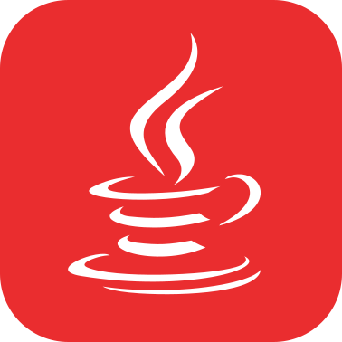
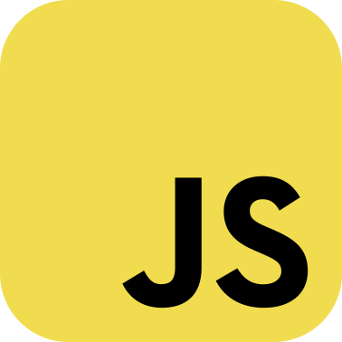

	

	
	
	
	
	
	

## :cat2::computer:  **overview:~$**

**Hi!** I'm a long-time tech nerd from the U.S. I enjoy digging deep into software and am fascinated and interested in every little thing.
My main focus is on backend and game development, but on occasion I also do web development.

My programming journey started in 2019 when I picked up Java to make mods for Minecraft.
Since then I've done a lot in it and it is the language I'm most experienced in, although I prefer Rust for its ecosystem, tooling, and advantages.

## :sparkles:  **fancy_stuff:~$**

## :hammer:  **platforms:~$**

